这是一个**[PyTorch](https://pytorch.org)的目标检测教程**。

这是我正在写的[一系列教程](https://github.com/sgrvinod/Deep-Tutorials-for-PyTorch)中的第三个，这些教程是关于你自己用牛逼的PyTorch库*实现*一些很酷的模型的。

假设你已经掌握了这些基础：Pytorch，卷积神经网络。

如果你是PyTorch新手，先看看[PyTorch深度学习：60分钟闪电战](https://pytorch.org/tutorials/beginner/deep_learning_60min_blitz.html)和[通过例子学习PyTorch](https://pytorch.org/tutorials/beginner/pytorch_with_examples.html)。

问题，建议或者勘误可以发送到issues。

我的环境是`Python 3.6`下的`PyTorch 0.4`。

---

**2020年2月27日**：两个新教程的工作代码已经添加——[Super-Resolution](https://github.com/sgrvinod/a-PyTorch-Tutorial-to-Super-Resolution)和[Machine Translation](https://github.com/sgrvinod/a-PyTorch-Tutorial-to-Machine-Translation)

# 目录

[***目标***](https://github.com/sgrvinod/a-PyTorch-Tutorial-to-Object-Detection#objective)

[***概念***](https://github.com/sgrvinod/a-PyTorch-Tutorial-to-Object-Detection#concepts)

[***概览***](https://github.com/sgrvinod/a-PyTorch-Tutorial-to-Object-Detection#overview)

[***实现***](https://github.com/sgrvinod/a-PyTorch-Tutorial-to-Object-Detection#implementation)

[***训练***](https://github.com/sgrvinod/a-PyTorch-Tutorial-to-Object-Detection#training)

[***评估***](https://github.com/sgrvinod/a-PyTorch-Tutorial-to-Object-Detection#evaluation)

[***推理***](https://github.com/sgrvinod/a-PyTorch-Tutorial-to-Object-Detection#inference)

[***FAQs***](https://github.com/sgrvinod/a-PyTorch-Tutorial-to-Object-Detection#faqs)

# 目标

**建立一个模型来检测和定位图片中的某个目标。**

<p align="center">

</p>

我们将会实现 [Single Shot Multibox Detector (SSD)](https://arxiv.org/abs/1512.02325)，一款该任务下流行、强大并且十分灵活的网络。作者原始的实现能在[这里](https://github.com/weiliu89/caffe/tree/ssd)找到

以下是一些图片上看不见的目标检测的例子——

---

<p align="center">
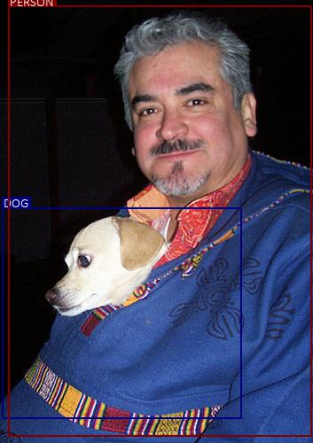
</p>

---

<p align="center">
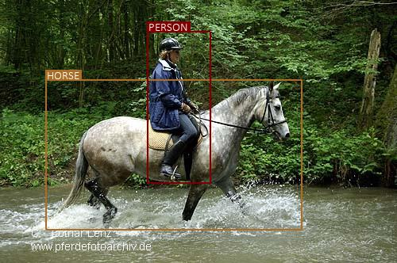
</p>

---

<p align="center">
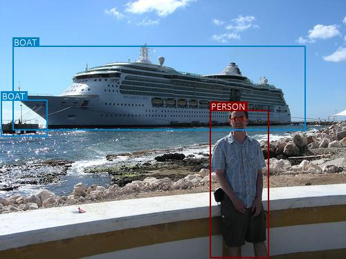
</p>

---

<p align="center">
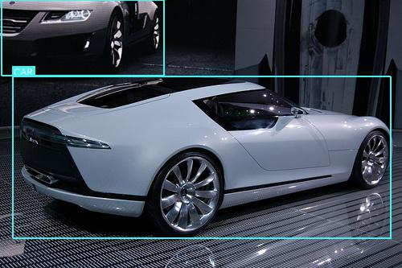
</p>

---

<p align="center">
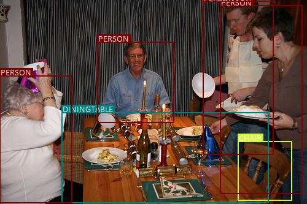
</p>

---

<p align="center">
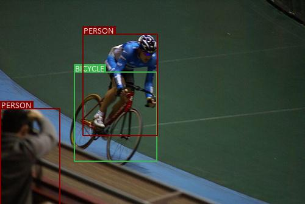
</p>

---

<p align="center">
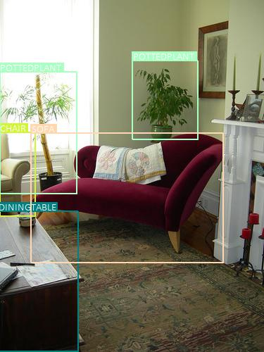
</p>

---

<p align="center">
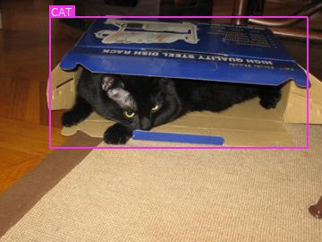
</p>

---

[教程末尾](https://github.com/sgrvinod/a-PyTorch-Tutorial-to-Object-Detection#some-more-examples)有更多的例子。

---

# 概念

- **目标检测**（Object Detection）：不解释。
- **SSD**（Single-Shot Detection）：早期目标检测分为两个部分——一个是找出目标位置的网络（原文强调该网络负责提出那些存在目标的区域），和一个检测目标区域中实体的分类器。从计算角度来说，这两部分可能会非常贵并且对于实时、实地应用都不合适。SSD模型把精定位和检测任务压缩到一个网络的单次前向传播过程，在能部署在更轻量级的硬件上的同时带来了显著更快的检测。
- **多尺寸特征图**（Multiscale Feature Maps）：在图像分类的任务中，其预测结果是建立在最后一层卷积特征图上的，这一层特征图是最小但同时也是原图最深层次的代表。在目标检测中，来自中间卷积层的特征图也会_直接_起作用，因为它们代表了原图的不同尺寸。因此，一个固定尺寸的过滤器(卷积核)作用于不同的特征图能检测出不同尺寸的目标。
- **预定位**（Priors）：在一张特征图上的具体位置上会有一些预定位框（原文这里指提前定位好），这些定位框有着特定的大小。预定位框是仔细选择后与数据集中目标的定位框（也就是数据集中实实在在的定位框）特征最相似的
- **多定位框**（Multibox）：一种把预测定位框表述为回归问题的[技术](https://arxiv.org/abs/1312.2249)，检测目标的坐标回归到它真实的坐标。此外，对于每一个将要被预测的定位框，对于不同的目标类别会有不同的得分。预定位将作为预测的可行起始点，因为这些预定位框是根据事实（数据集）建模的。因此将会出现与预定位一样多的预测框，尽管大多数可能不含有目标。
- **硬性负样本挖掘**（Hard Negative Mining）：这指的是选择那些预测结果中令人震惊的假正例(FP:False Positive)，并加强在这些样本上的学习。换句话说，我们仅在模型中_最难_正确识别的负样本中挖掘信息。如上文所说绝大多数预测框不含目标，这可以平衡正负样本。
- **非最大抑制**（Non-Maximum Suppression）：对于任意给定位置，显然多个预定位框会重叠。因此，由这些预定位框产生的预测实际上可能是同一个重复的目标。非最大抑制（NMS）是通过抑制除了最高得分以外的所有预测来消除冗余的手段。

# 概览

这一部分，我会讲一下这个模型的概述。如果你已经熟悉了，你可以跳过直接到[实现](https://github.com/sgrvinod/a-PyTorch-Tutorial-to-Object-Detection#implementation)部分或者去看看代码注释。

随着我们的深入，你会注意到SSD的结构和思想包含了相当多的工程设计。如果一些概念看起来相当做作或是不讲道理，别担心！记住，它建立在这个领域多年的研究之上（通常是经验主义的）

### 定义

边框就是一个盒子。定位框就是将目标围起来的盒子，也就代表了目标的边界

在这个教程中，我们只会遇到两种类型——边框和定位框。但是所有的边框都只会呈现在图片上并且我们需要能够计算他们的位置、形状、大小还有其他属性

#### 边界坐标

最明显的方式来描述一个边框是通过边界线`x`和`y`的像素坐标

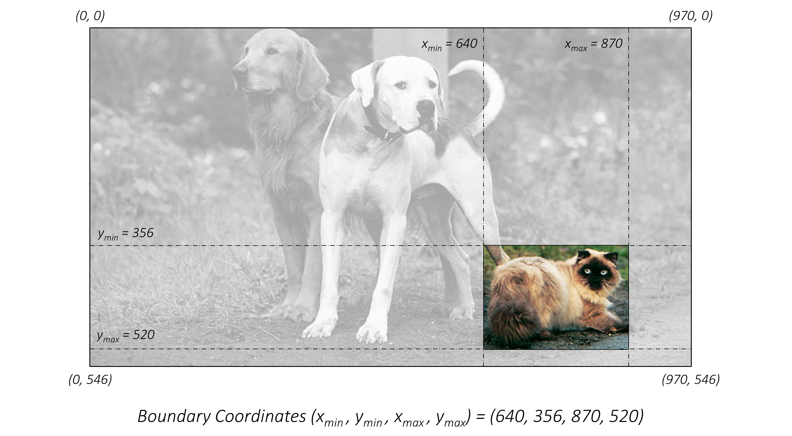

这张图中的定位框的边界坐标就是**`(x_min, y_min, x_max, y_max)`**

但如果我们不知道实际图像的尺寸，像素值几乎是没用的。一个更好的办法是将所有坐标替换为它们的分数形式

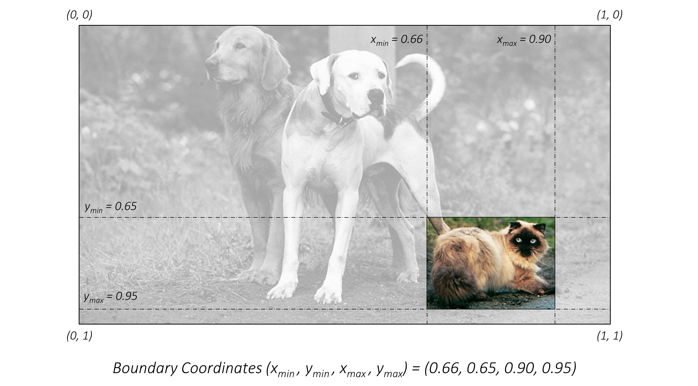

现在坐标就与图像大小无关并且所有图片上的所有边框都在同一尺度下。

#### 中心——大小坐标

这是一个对边框位置和大小更直接的表示

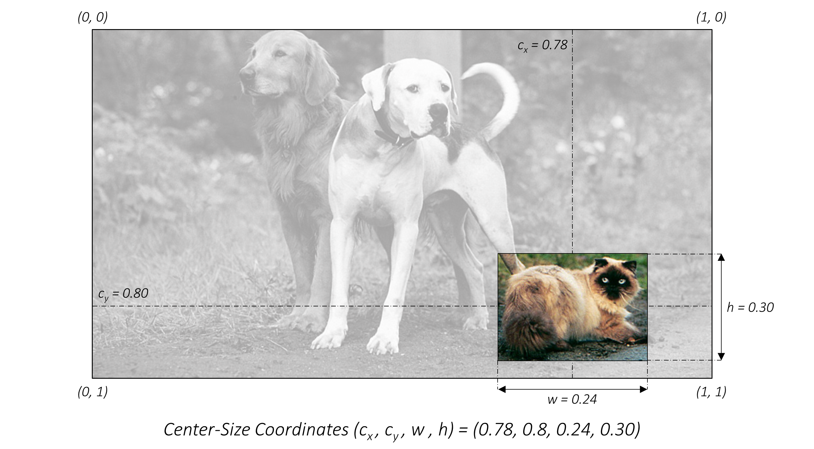

这张图的中心——大小坐标就是**`(c_x, c_y, w, h)`**。

在代码中，你会发现我们通常两种坐标都会使用，这取决于它们对任务的适应性，并且我们_总是_使用它们的分数形式

#### 交并比(Jaccard Index)

Jaccard Index也叫Jaccard Overlap或者说交并比（ Intersection-over-Union loU）用于测量两个边框的重叠程度

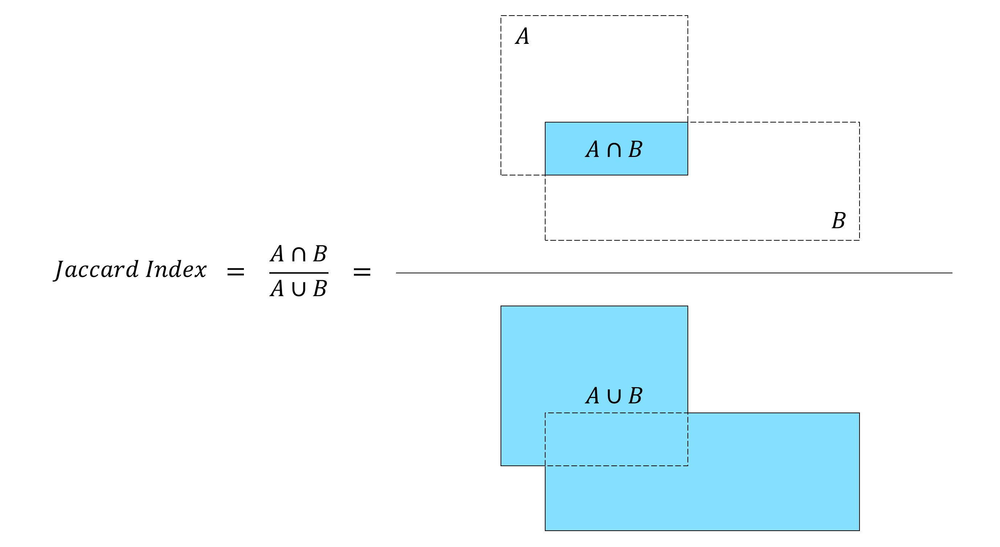

交并比等于1意味着两个边框相同，0表示两个边框互斥

这是一个数学度量，但同样能在我们的模型中找到许多应用

### 多边框

多边框是一个目标检测的技术，其由两个部分组成——

- **可能含也可能不含的目标的边框的坐标**。这是一个回归问题。
- **特定边框中不同目标类型的得分**，包括一个*背景*类来表示边框中没有目标，这是一个*分类*任务

### Single Shot Detector (SSD)

SSD是一个纯粹的卷积神经网络（CNN），我们可以把它归结为三类——

- **基础卷积** 借鉴自现有的图片分类结构，这个结构将提供低维特征
- **辅助卷积** 添加在基础网络之上，这个结构将提供高维特征
- **预测卷积** 这个结构将在特征图中定位并识别目标

论文中给出了这个模型的两种变体：SSD300与SSD512。

其中后缀代表输入图片的大小，尽管两种网络在构建的时候稍有不同，但他们在原理上是一致的。SSD512仅仅知识更大而稍好一点的网络

### 基础卷积——part1

首先，为什么在现存网络中使用卷积结构？

因为经过论证在图片分类表现良好的模型，已经有相当好的图片本质捕捉能力。同样的卷积特征在目标检测上十分有用，尤其是局部感知上——我们更想关注目标所在的部分而不是把图像当做一个整体

此外，优势还有能够使用在可靠分类数据集上的预训练层。正如你所知道的，这叫做*迁移学习*。通过借鉴一个不同但是密切相关的任务，我们甚至在开始前就有了进展。

论文的作者将**VGG-16结构**作为其基础网络。它的原始形式相当简单。

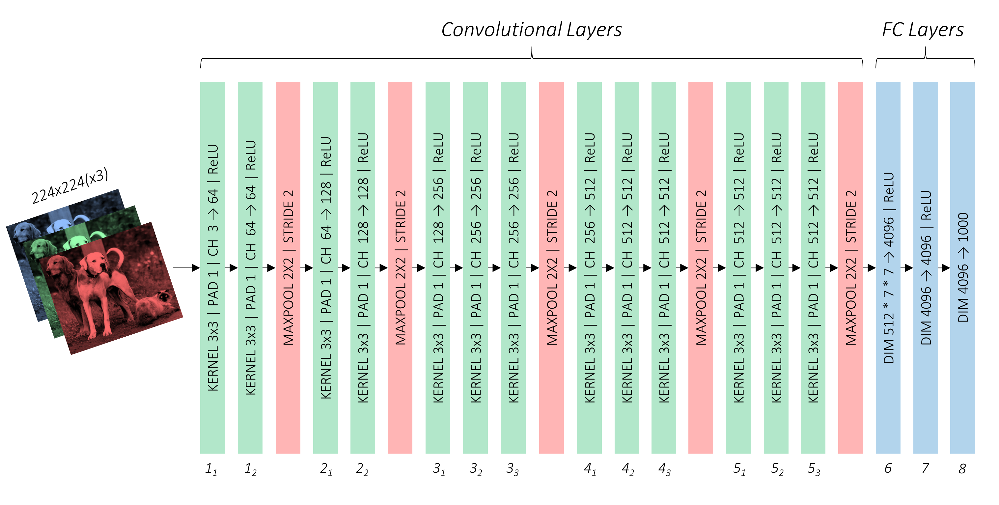

他们建议使用在ImageNet*大规模视觉识别竞赛*（ILSVRC）分类任务中预先训练过的模型。幸运的是，PyTorch中已经有一个可用的模型，其他流行的AI引擎也是如此。如果你愿意，你可以选择像ResNet这样更大的东西。只需注意计算要求。

 根据这篇论文，**我们必须对这个预先训练的网络进行一些更改**，以使其适应我们自己在目标检测方面的挑战。有些是合乎逻辑和必要的，而另一些则主要是出于方便或偏好。  

- **输入大小**：如上所说`300, 300`
- **第三个池化层**：维度减半，确认输出大小将会使用数学中的`ceiling`函数（向上取整）而不是默认的`floor`函数。当前面的特征图的维度是奇数而不是偶数时这才重要。通过观察上面的图片，你能够计算出我们的输入图片大小是`300, 300``conv3_3`特征图将被截断为`75, 75`，这将被减半为`38, 38`，而不是麻烦的`37, 37`
- 我们将第**五个池化层**从`2, 2`内核，步长`2`修改为`3, 3`内核，步长`1`。这样做的效果是，它不再将先前卷积层的特征图的维度减半。
- 我们不需要全连接层（事实上是分类），他们在这里毫无用处。我们将完全砍掉`fc8`，并且选择***将*`fc6`和`fc7`重做为卷积层`conv6`和`conv7`**

第一步的三个修改已经足够直接了，但最后一个可能需要一些解释

### 全连接→ 卷积层(FC → Convolutional Layer)

我们如何将全连接层重新参数化为卷积层？

注意到下面的方案。

在典型的图像分类设置中，第一个全连接层不能对前面的特征图或图像_直接_进行操作。我们需要把它压扁成一维结构。

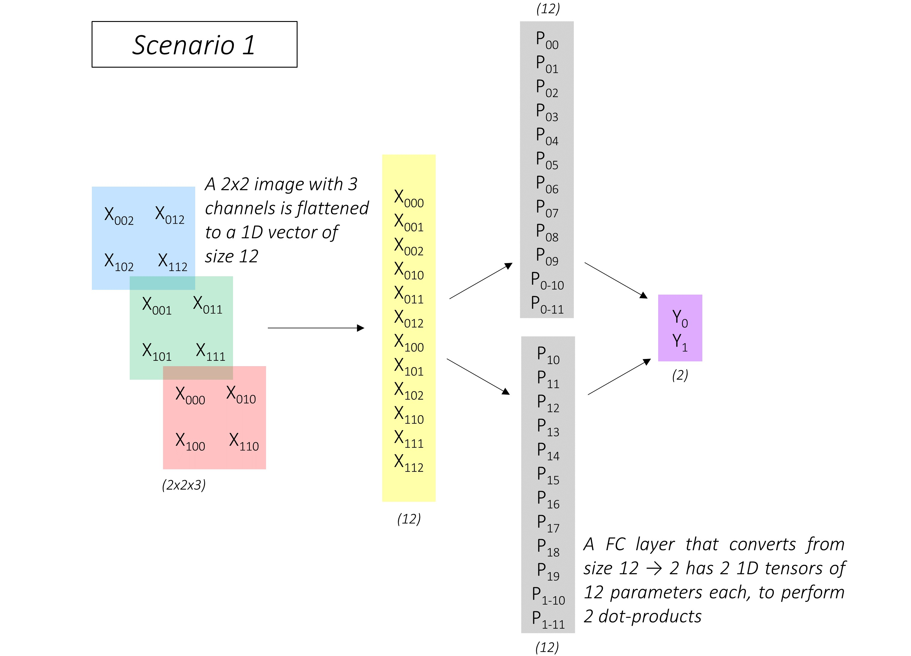

在这个例子中，有一张`2, 2, 3`维度的图片，展开为一个大小`12`的一维向量，对于输出大小`2`，全连接层计算两次点积，分别是这个展开的一维向量和两个相同大小`12`的向量的点积。**这两个向量，在图中用灰色表示，就是全连接层的参数**。

现在考虑一个不同的方案，在这个方案中，我们使用卷积层来产生两个输出值

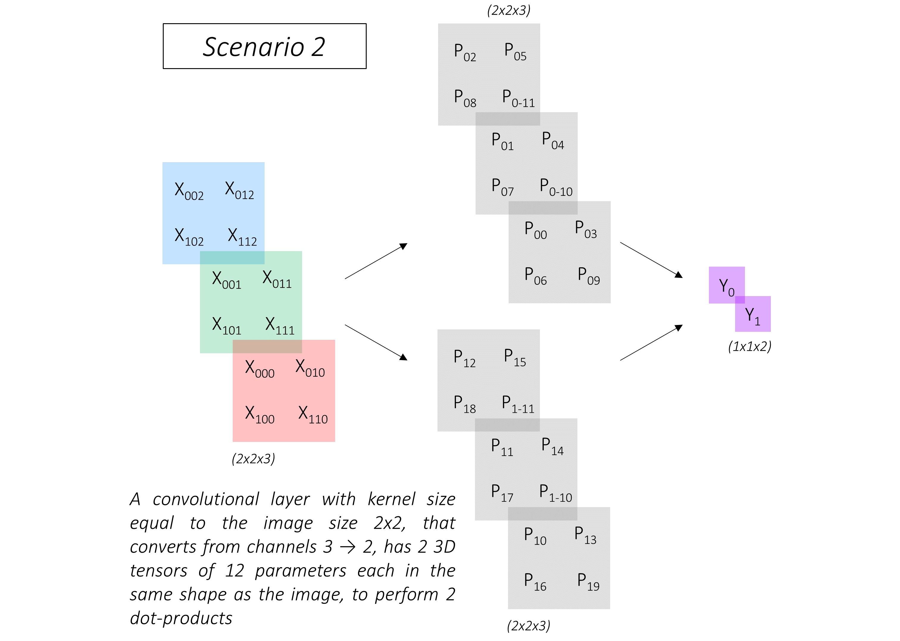

这里，图片的维度是`2, 2, 3`定死了要保证不被展开。卷积层使用两个过滤器来执行两个点积， 每个过滤器包含`12`个元素并与图像形状相同。**这两个过滤器，在图中用灰色表示，就是卷积层的参数**。

这就是关键点——**在两种方案中，输出`Y_0`和`Y_1`是一样的！**

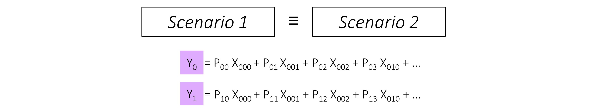

这两种方案是恒等的。

这告诉我们什么？

**在一张大小`H, w`，`I`通道的图片上，输出大小`N`的全连接层等价于卷积层，卷积核的大小与图片大小相同`H, w`，`I`通道**，这证明全连接层网络`N, H * W * I`的参数与卷积层`N, H, W, I`的参数相同

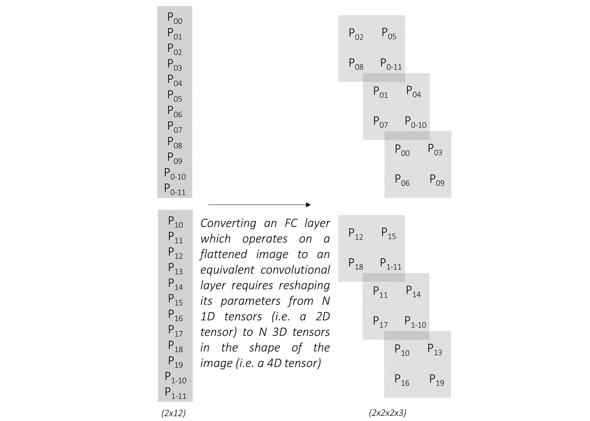

因此，**通过改变参数的形状**，任何全连接层都能被转换为一个等价卷积层。

### 基础卷积——part2

我们现在知道如何将原来VGG-16结构中的`fc6`与`fc7`分别地转换为`conv6`与`conv7`

在[之前展示]((https://github.com/sgrvinod/a-PyTorch-Tutorial-to-Object-Detection#base-convolutions--part-1))的ImageNet VGG-16中，在对图片大小为`224, 224, 3`的操作中，你能发现`conv5_3`的输出大小是`7, 7, 512`。因此——

- `fc6`的输入是展开的`7 * 7 * 512`，输出大小是`4096`包含`4096, 7 * 7 * 512`维度的参数。**其等价卷积层`conv6`的卷积核大小是`7, 7`,输出通道数是`4096`，全连接层参数的形状将被改变为`4096, 7, 7, 512`**。
- `fc7`的输入大小是`4096`(事实上就是`fc6`的输出)，输出大小是`4096`包含`4096, 4096`维度的参数。**其等价卷积层`conv6`的卷积核大小是`1, 1`,输出通道数是`4096`，全连接层参数的形状将被改变为`4096, 1, 1, 4096`**。

我们发现`conv6`有`4096`个过滤器，每一个的大小是`7, 7, 512`，`conv7`有`4096`个过滤器，每一个大小是`1, 1, 4096`。

这些过滤器很繁杂，也很大——并且算力消耗大

为了改进这一点，作者选择**通过二次采样来减少过滤器的数量和每个过滤器的大小**，对于转换后的卷积层。

- `conv6`将使用`1024`个过滤器，每个大小`3, 3, 512`。因此，参数从 `4096, 7, 7, 512`二次采样到 `1024, 3, 3, 512`。
- `conv7`将使用`1024`个过滤器，每个大小`1, 1, 1024`。因此，参数从 `4096, 1, 1, 4096`二次采样到 `1024, 1, 1, 1024`。

基于论文中的引用，我们将**沿特定维度选择第`m`个参数来二次采样**，在处理中被称为[降采样](https://en.wikipedia.org/wiki/Downsampling_(signal_processing))。

通过只保留第三个值，`conv6`的卷积核从`7, 7`降采样到`3, 3`，卷积核中现在有一些洞。因此我们需要**卷积核扩张或萎缩**

这相当于一个`3`的膨胀（与降采样因子`m = 3`相同）。尽管如此，作者实际上采用的是一个`6`的膨胀，大概是因为第5个池化层并不减半之前特征图的维度

我们现在处于搭建基础网络的位置，**VGG-16 修改版**。

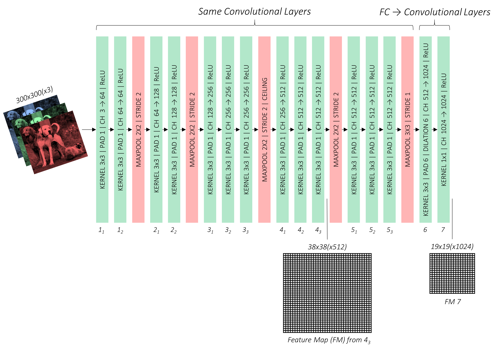

### 辅助卷积

现在我们将在**基础网络上叠加一些额外的卷积层**。这些卷积提供了额外的特征图，每个特征图都会逐渐变小

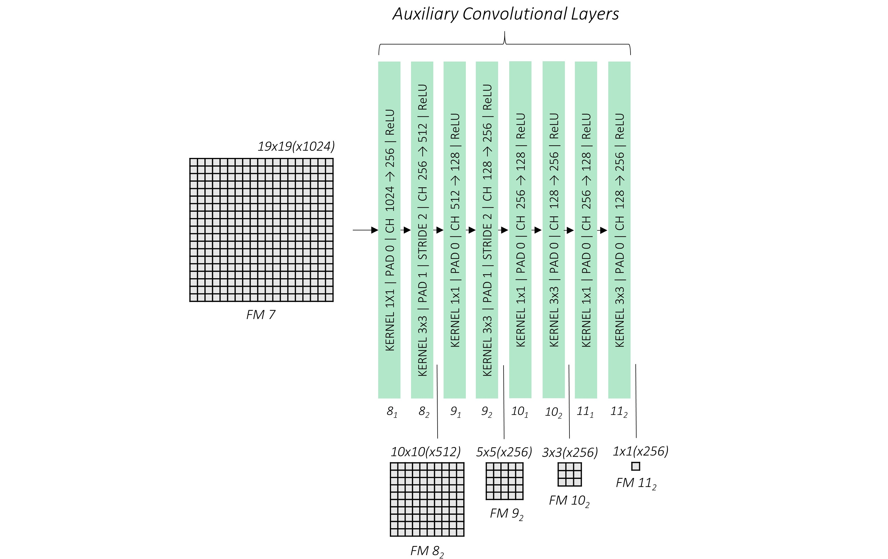

图中展示了4个卷积块，每个块都有两层。在基础网络中的池化层也有减少维度的作用，而这里通过把每个块中第二层的步长设置为`2`促进这个过程。

同样地，请留意这些来自`conv8_2`, `conv9_2`, `conv10_2`, 和`conv11_2`的特征图。

### 思考

在我们进入预测卷积之前，我们首先需要了解我们在预测的是什么。很明显，是目标和目标所在的位置，*但它们是以什么形式给出的？*

现在我们得了解一些关于**预定位**和它在SSD中的关键作用

#### 预定位

预定位是十分多样的，并不只是在预测的种类上。目标可以出现在任何位置，大小和形状都是任意的。同时，我们不应该说目标出现在哪、以何种方式出现都有**无限**可能。尽管在数学上是对的，但也有许多的选择是不合理的。更进一步来讲，我们不必要求边框在像素上是完美的。

事实上，我们能把潜在的预测空间从数学上减少到仅几千几万种可能。

**框预定位是提前计算好的，也是固定的，它代表其中的所有可能和近似的边框预测**

在数据集中实实在在的目标的形状和大小上，预定位必须精挑细选。同样考虑到位置的多样性，我们把预定位放在特征图中的每一个可能的位置。

在预定位框的定义中，作者特别指出——

- **这将会应用与各种各样的低维和高维特征图**，也就是那些来自 `conv4_3`, `conv7`, `conv8_2`, `conv9_2`, `conv10_2` 和`conv11_2`的特征图。这些都是在之前图上表明的特征图
- **如果预定位框有一个缩放量`s`，那么它的面积等于一个边长为`s`的正方形**，最大的特征图，`conv4_3`，其预定位的缩放量为`0.1`，也就是`10%`的图片维度，同样的，其余预定位的缩放量从`0.2`到`0.9`线性递增。正如你所想，最大的特征图的预定位缩放量更小，并且因此能够检测更小的物体
- **在特征图的*每一个*位置，都会各种各样的预定位框，这些预定位框有着不同的横纵比**。所有的特征图都会有如下横纵比的预定位框`1:1, 2:1, 1:2`。`conv7`, `conv8_2`, 和`conv9_2`中间层的特征图的预定位框将有*更多*的横纵比`3:1, 1:3` 。更进一步，所有特征图将有一个额外预定位框，其横纵比为`1:1`，其缩放量为当前特征图与后继特征图缩放的几何平均数。

| 特征图来源 | 特征图大小 | 预定位框缩放量 |             横纵比             | 每个位置的预定位框数量 |   预定位框总数    |
| :--------: | :--------: | :------------: | :----------------------------: | :--------------------: | :---------------: |
| `conv4_3`  |   38, 38   |      0.1       |      1:1, 2:1, 1:2 + 额外      |           4            |       5776        |
|  `conv7`   |   19, 19   |      0.2       | 1:1, 2:1, 1:2, 3:1, 1:3 + 额外 |           6            |       2166        |
| `conv8_2`  |   10, 10   |     0.375      | 1:1, 2:1, 1:2, 3:1, 1:3 + 额外 |           6            |        600        |
| `conv9_2`  |    5, 5    |      0.55      | 1:1, 2:1, 1:2, 3:1, 1:3 + 额外 |           6            |        150        |
| `conv10_2` |   3,  3    |     0.725      |      1:1, 2:1, 1:2 + 额外      |           4            |        36         |
| `conv11_2` |    1, 1    |      0.9       |      1:1, 2:1, 1:2 + 额外      |           4            |         4         |
|  **总计**  |     –      |       –        |               –                |           –            | **8732 预定位框** |

SSD300中一共有8732个预定位框！

#### 可视化预定位框

我们根据预定位框的*缩放量*和*横纵比*来定义预定位框

*（译者注：w即width宽度，h即hight高度，s即scales被译为缩放量，a即aspect ratios被译为横纵比）*

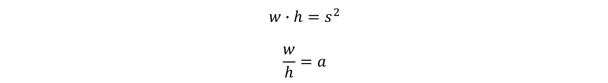

变换这些方程可以得到预定位框的维度`w`和`h`

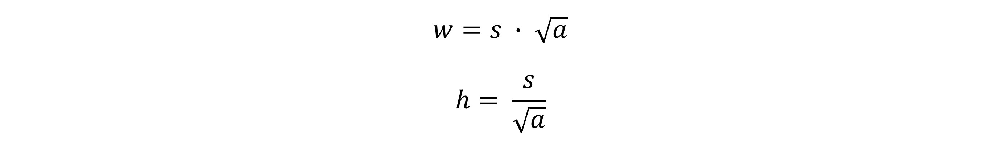

我们现在可以分别地在特征图上画出预定位框

例如，我们想要可视化`conv9_2`中心方块上的预定位框是什么样的


*（译者注：图中文字内容如下，在每个位置，有五个预定位框，其横纵比分别为1,2,3,1/2,1/3并且面积等于边长为0.55的正方形。另外，第六个预定位框的横纵比是1，边长为0.63）*

同样地可以看到其他方块上的预定位框

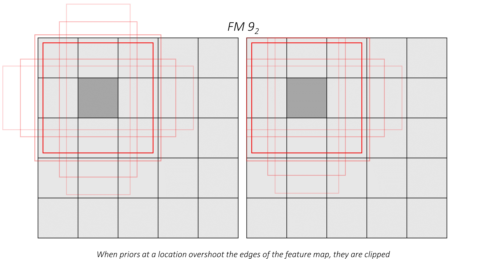

*（译者注：图中文字内容如下，当预定位框超过特征图的边界时，超出的部分会被剪掉）*

#### 预测与预定位框的异同

[之前](https://github.com/sgrvinod/a-PyTorch-Tutorial-to-Object-Detection#multibox)，我们说我们将会使用回归去找到目标定位框的坐标。但是，预定位框不能作为最终的预测框吗？

显然它们不能。

我再次重申，预定位框*近似地*代表预测的可能性。

也就是说**我们把每个预定位框作为一个近似的起始点，然后找出需要调整多少才能获得更精确的定位框预测**

因此，每一个定位框与预定位有轻微的偏差，我们的目标就是去计算这个偏差，我们需要一个办法去测量或者说评估这个偏差

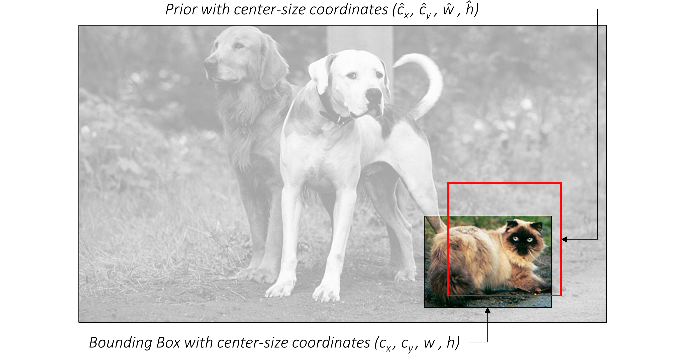

*（译者注：图中文字大致内容，预定位框的坐标和大小`c_x_hat, c_y_hat, w_hat, h_hat`；定位框坐标和大小`c_x, c_y, w, h`）*

假设我们用熟悉的中心坐标+大小的坐标表示

那么——

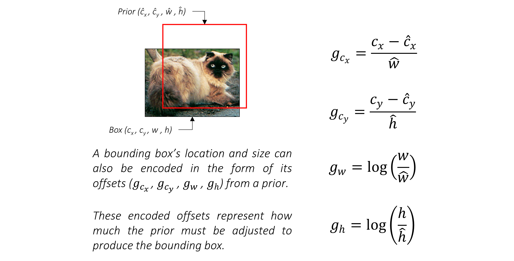

*（译者注：图中文字内容如下，定位框的位置和大小同样能够用与预定位框的偏移量来表示，这些被偏移量所表示的偏差代表预定位框接近定位框需要调整的量）*

这回答了我们在这部分[开始提出的问题](https://github.com/sgrvinod/a-PyTorch-Tutorial-to-Object-Detection#a-detour)。为了调整每一个预定位框去得到一个更精确的预测结果，**这四个偏移量`(g_c_x, g_c_y, g_w, g_h)`就是回归定位框坐标的形式**。

如你所想，每一个偏移量都由相应的预定位框的维度来归一化。这说得通，因为比起小的预定位框，对于更大的预定位框来说，某些偏移量可能不是那么重要。

### 预测卷积

在前面的部分中，我们定义了6个特征图的预定位框，其有着不同的缩放量和大小。也就是`conv4_3`, `conv7`, `conv8_2`, `conv9_2`, `conv10_2`, 和`conv11_2`中的预定位框

现在，**对于*每个*特征图上的*每个*位置，其中的*每一个*预定位框**，我们需要预测——

- 定位框的**偏移量`(g_c_x, g_c_y, g_w, g_h)`**。
- 在定位框中的一系列**`n_classes`分数**，其中`n_classes`表示目标的类别数（包含背景这个类别）

为了以最简单的方式做到这一点，**在每个特征图上我们需要两个卷积层**——

- 一个**位置预测**卷积层，其含有`3, 3`的卷积核，在每个位置进行评估（也就是padding和stride参数为`1`），对于在该位置上的*每一个*预定位框都设有`4`个过滤器。

  这`4`个过滤器负责计算偏移量 `(g_c_x, g_c_y, g_w, g_h)` ，该偏移量来自定位框与预定位框

- 一个**类别预测**卷积层，其含有`3, 3`的卷积核，在每个位置进行评估（也就是padding和stride参数为1），对于该位置上的每一个预定位框都设有`n_classes`个过滤器。

  这`n_classes`个过滤器负责计算该预定位框上的一系列`n_classes`分数

  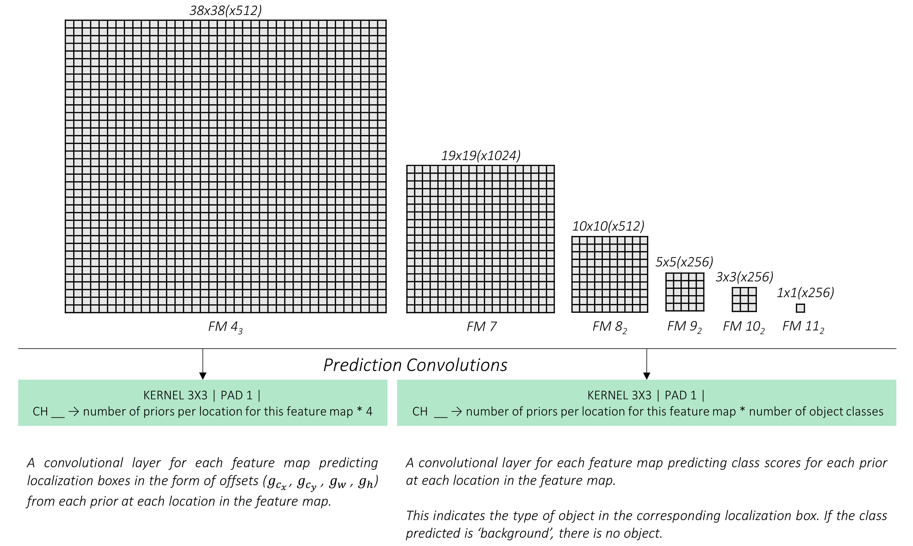


*（译者注：图片大意：*

*左：位置卷积，对于特征图中每个位置上的每一个预定位框，预测出的定位框以偏移量的形式给出`g_c_x, g_c_y, g_w, g_h`。该层输出通道为 每个位置上的预定位框数 \* 4*

*右：预测卷积，对于特征图上每个位置上的每一个预定位框，给出目标类别的得分，这表示的是框内是什么类别，如果预测结果为“background”，就说明框内无目标。该层输出通道为 每个位置的预定位框数 \* 目标类别数）*

我们的将过滤器的卷积核设置为`3, 3`

我们不太需要卷积核（或者说过滤器）与定位框的形状相同，因为不同的过滤器将会进行关于不同形状的预定位框的预测。

接下来我们看看**这些卷积的输出**。再次以`conv9_2`的特征图为例。

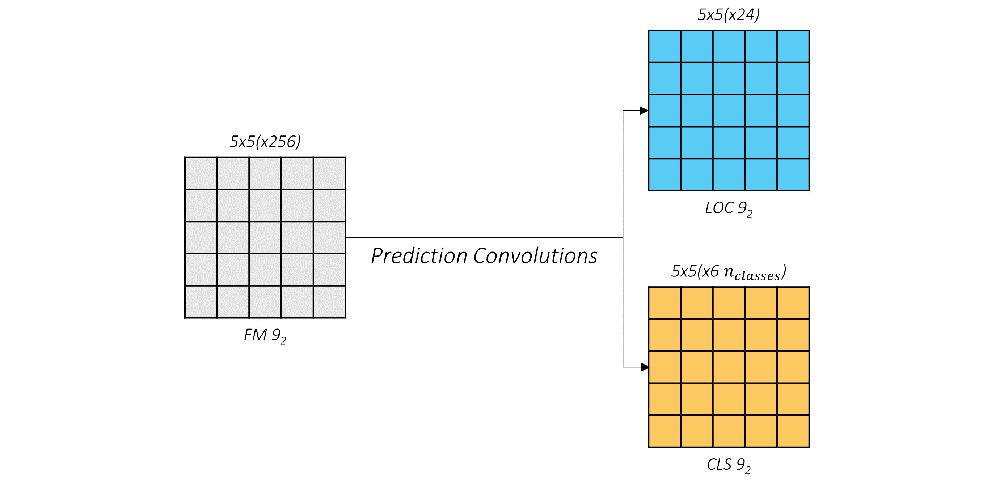

定位卷积和预测卷积的在图中分别以蓝色和黄色表示。可以看到横截面没有改变（图中指灰色、蓝色、黄色三个部分前两维度相同）。

我们真正需要关心的是*第三个*维度，也就是通道数。其中包含了实际预测。

图中，如果你**选择任意一个定位预测方块并展开它**，你会看到什么？

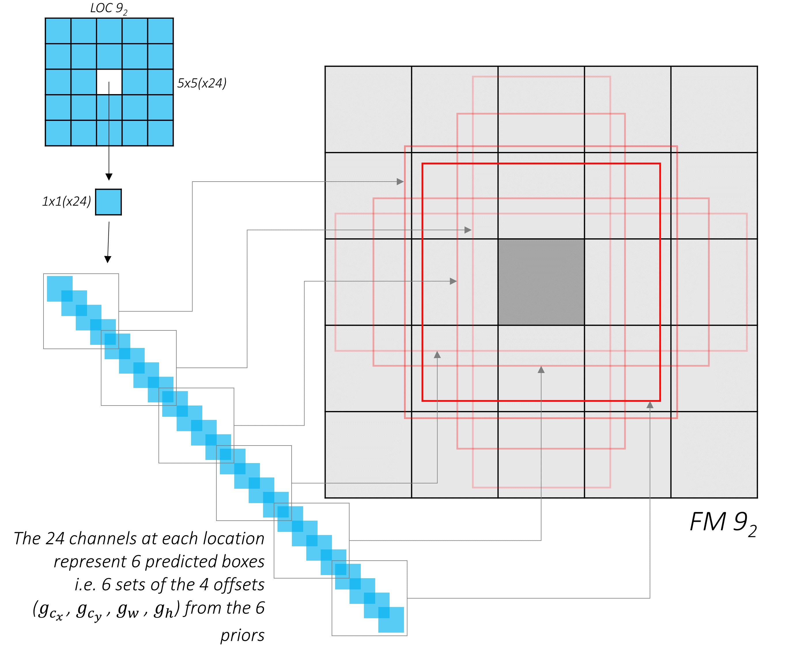

*（译者注：图中文字大意：在每个位置的24个通道代表了6个定位框预测，也就是来自6个预定位框的6组的偏移量，每个偏移量包含四个结果`g_c_x, g_c_y, g_w, g_h`）*

同样的，我们对类别预测做同样的操作。假设`n_classes = 3`

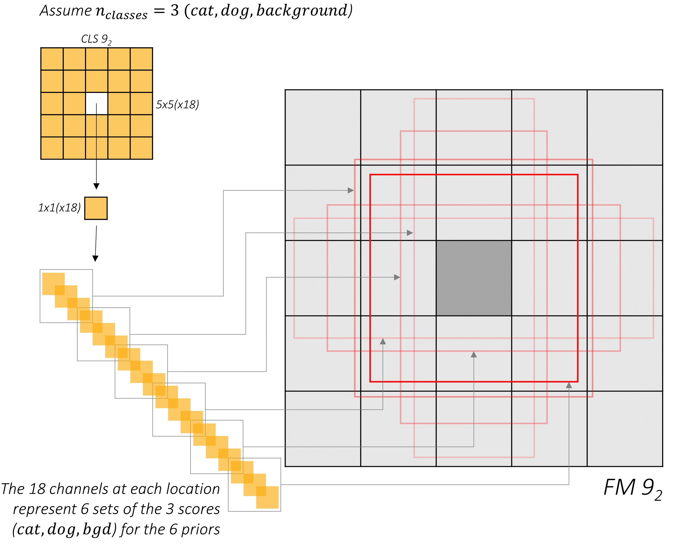

*（译者注：文字大意：假设三种类别`(cat, dog, backgroud)`，在每个位置上的18个通道代表了6个预定位框的6组预测结果，每组预测结果包含3种得分`(cat, dog, bgd)`）*

与之前相同，这些通道代表在这个位置上定位框的得分

现在我们明白了来自`conv9_2`的特征图的预测结果是什么样的，我们可以把它**重塑为更方便处理的形状**

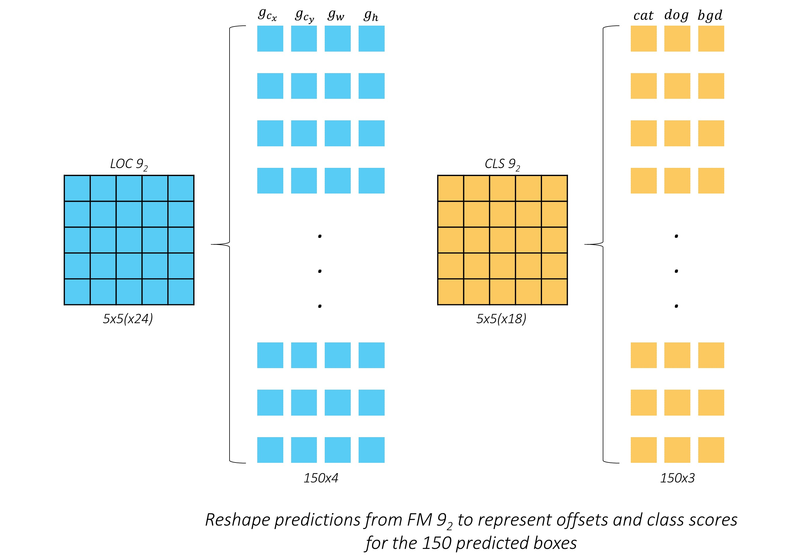

*（译者注：文字大意：对FM9_2预测结果重塑，让其表示150个定位框的偏移量和得分）*

但我们不仅仅停留在这一步，我们可以对*所有*层的预测结果做相同的处理，然后把他们叠在一起。

之前我们计算模型中出一共有8732个预定位框。因此，**一共有8732个定位框预测以偏移量的形式表示，并有8732组类别得分**

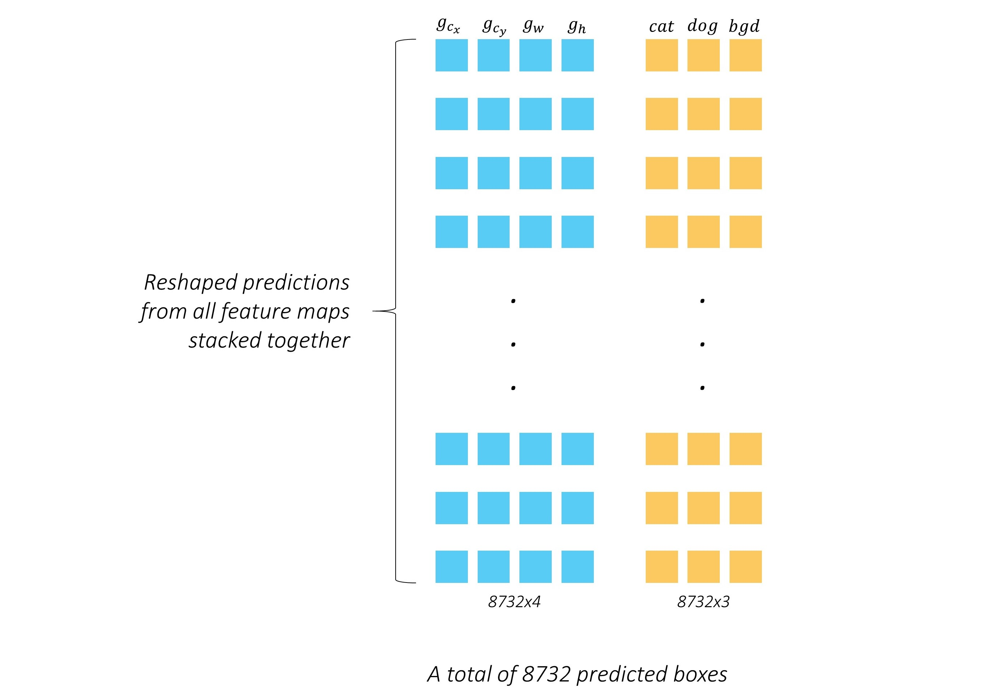

*(译者注：文字大意：重塑后的特征图，并将他们拼接在一起，一共有8732个定位框预测)*

**这就是预测阶段的最终输出**，一系列定位框的叠加，如果你愿意，你可以估计一下里面是些啥。

我们已经到这里了，不是吗？如果这是你首次涉足目标检测，我想这便是星星之火。

### 多定位框损失

通过我们预测结果的本质，不难看出为什么我们需要这么一个独一无二的损失函数。许多人都在计算回归或者分类中算过损失，但是几乎没有人把这两种损失*结合*起来（如果有这种情况的话）

显然，我们的总损失必须是**两种预测损失的总和**——定位框位置和类别得分

接下来出现了这些问题

> *定位框的回归问题采用什么损失函数？*

> *类别得分的损失函数应该是交叉熵损失吗？*

> *以何种比例将二者结合？*

> *如何比较预测框的预测值与真实值*

> *一共有8732个预测结果！不是大多数都不包含目标吗？我们也需要考虑这些结果吗？*

氦，我们得继续上路了

#### 预测值与真实值的比较

记住，监督学习的要点是**我们需要比较预测值与真实值**。这非常棘手，因为目标检测比一般的机器学习任务更加不确定。

对于一个模型，学习*任何事物*我们都需要构造一个关于预测值与真实值比较的问题。

预定位框恰恰能做到这一点

- **找到交并比**，这里交并比是指8732个预定位框与`N`个目标真实值的交并比，这是一个大小`8732, N`的张量（tensor）
- 将8732个预定位框中与目标重叠最大的预定位框，与目标配对起来
- 如果一个预定位框与目标配对后的交并比小于`0.5`，那么它就不“含有”目标，因此它就是一个***负*匹配项**。我们有成千上万的预定位框，对于一个目标，许多都将测出是一个负匹配项
- 另一方面，少数预定位框与目标是**明显重叠（大于`0.5`）**的，可以认为其“含有”这个目标。他们就是***正*匹配项**
- 现在我们有**8732个预定位框与一个真实值的配对**，事实上，我们同样有**相应的8732个预测值与1个真实值的配对**

让我们用一个例子来重新理解一个这个逻辑

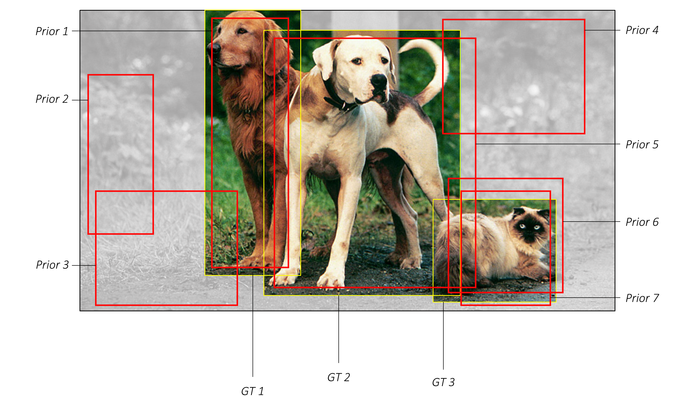

为了方便理解，假设只有7个预定位框，在图中以红色表示。目标在黄色方框内——这张图中有3个实实在在的目标。

根据之前的大概步骤，产生了下面的配对——

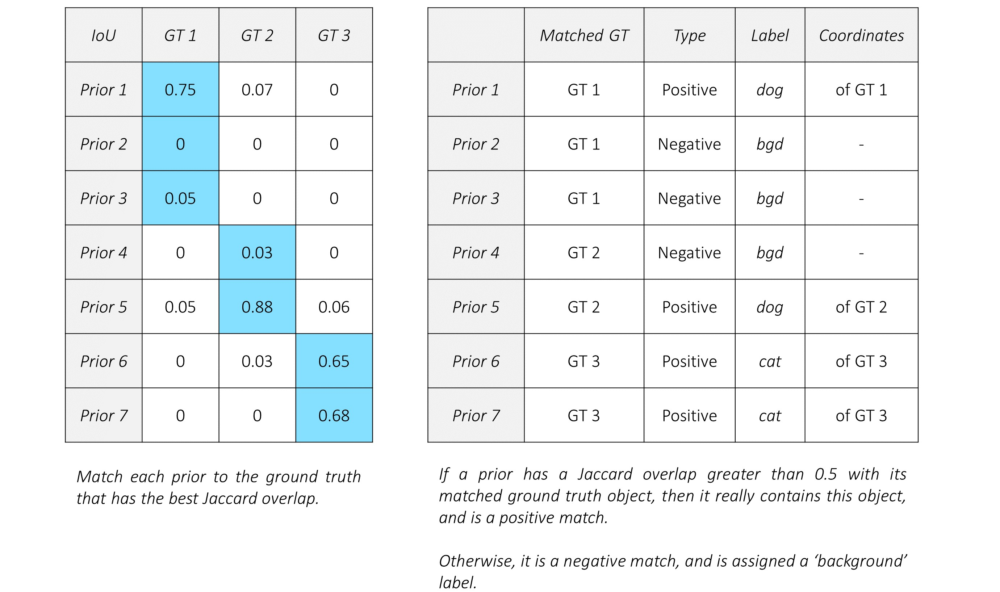

*（译者注：文字大意：*

*左边：将每个预定位框与目标具有最大交并比的两项配对*

*右边：如果一个预定位框与同其配对的目标的交并比大于0.5，他就会含有目标，并作为一个正匹配项。否则，他就是负匹配项，被分配到一个“background”标签）*

现在，每一个预定位框都有一个配对，他要么是正匹配项，要么是负匹配项。同理，每一个预测值都有一个配对，或正或负。

现在，与目标匹配为正的预测值具有实际的坐标，这些坐标将会作为定位的目标，也就是*回归*任务。自然地，负匹配项中就没有目标坐标。

所有的预测值都有一个标签，这个标签要么是目标类别（如果其为正匹配项），要么是*background*（如果其为负匹配项）。这些被当做**类别预测的目标**，也就是*分类*任务

#### 定位损失

对于**负匹配项**，我们**没有真实坐标**。这很好理解，为什么要训练模型在空间中画这么多框呢？

正匹配项中预测定位框到真实坐标回归得怎么样，决定了定位损失。

我们预测的定位框是以偏移量的形式给出`(g_c_x, g_c_y, g_w, g_h)`，在进行损失计算前，或许还需要把真实坐标也这样编码。

定位损失是**Smooth L1**损失在正匹配项中编码后的定位框偏移量与其真实值之间的损失的平均值

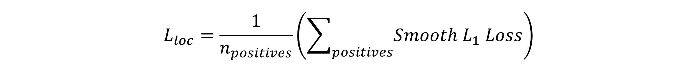

置信度损失

每一个预测值，无论正负，都有一个真实标签与其相关联。在模型识别是否有目标的时候这很重要。

无论如何，一张图片中的目标一只手都能数过来，**绝大多数我们的预测结果中不包含一个目标**。正如Walter White所说，*动作要轻*。如果正匹配项消失在茫茫负匹配项中，我们会以这个模型不太可能检测到目标结束，因为它往往学会了检测*background*类。

其解决办法很明显——限制参与损失计算的负匹配的数量。但是如何抉择？

好吧，为什么不使用模型*错*得最多那些负匹配项？换句话说，仅仅让那些模型认为难以识别这里没有目标的负匹配项。这叫**硬性负样本挖掘（Hard Negative Mining）**

假如说我们要使用的硬性负样本数量为`N_hn`，通常是与这张图像正匹配数的固定倍数。在这特定的种情况下，作者决定使用3倍的隐形负样本，也就是说`N_hn = 3 * N_p`。找出负匹配项预测值的交叉熵损失的前`N_hn`个负匹配项（top_k），这些就是最硬的硬性负样本。

接下来，置信度损失就是简单的正匹配项，和硬性负样本匹配项**交叉熵损失**的求和

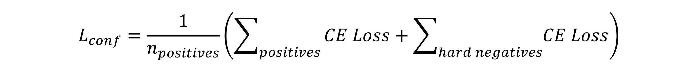

请注意损失被正匹配项的数量平均

#### 总损失

**多定位框损失是两种损失的综合**，其结合因子为`α`。

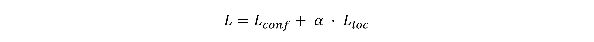

通常来说，我们不需要决定`α`的值。它是一个可学习的参数。

无论如何，对于SSD，作者仅仅只是去`α = 1`，也就是两种损失相加。我们也就这样吧！

### 预测结果处理

模型在训练之后就能给它喂图片了。但是出来的预测结果是原始形式——两个张量分别表示预定位框的偏移量和类别得分。需要将这些数据处理为**人能看懂的边框和标签的最终形式**。

这就需要接下来的操作——

- 我们有8732个预测定位框，其形式以相应的预定位框偏移量表示`(g_c_x, g_c_y, g_w, g_h)`。把他们解码回边界坐标，也就是能直接看懂的坐标。
- 接下来，对于每个*非background*类。
  - 提取出8732个框中每个框的得分。
  - 去掉那些分数没达到某个阈值的的预测定位框。
  - 剩下的定位框就是该类目标的候选结果

到这里，如果你把这些预测定位框在原图上画出来，你能看到**许多高度重叠的边框，它们明显是冗余的**。这是因为在成千上万个预定位框中，及其有可能不止一个预测结果指的是用一个目标。

例如下面这张图

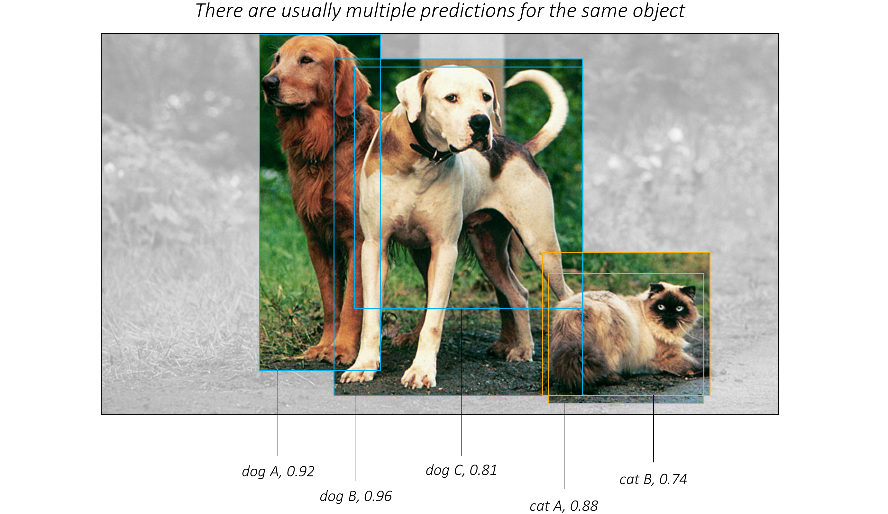

*（译者注：文字大意：通常有好几个预测结果指向同一个目标）*

图上清晰可见的三个目标——两只狗和一只猫。但是根据模型给出的结果，其中有*三*只狗和*两*只猫。

注意，这只是一个简单的例子。更糟糕的情况是超级多的框。

现在，对于你来说，哪些框指的是用一个目标很明显。因为你能认出在特定目标上的框与彼此十分相似。

事实上，这是如何做到的呢？

首先，**按照*置信度*排列每个类的候选结果**

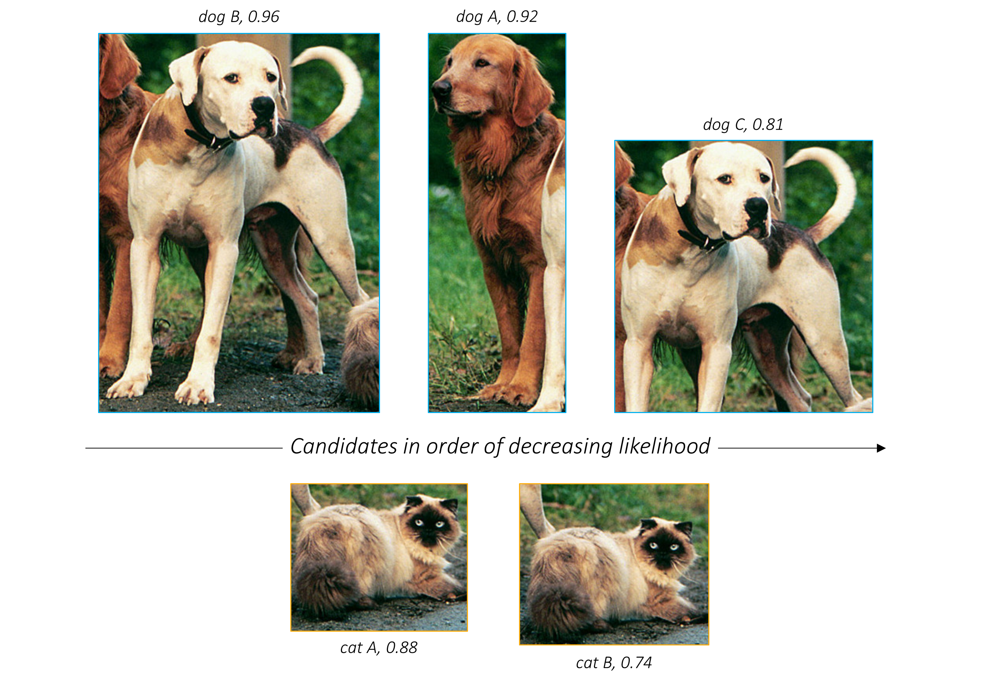

通过其得分来排列他们。

下一步是找出哪些候选结果是冗余的。在我们的处理过程中，我们已经有了一个工具可以判断两个框的相似度——交并比。

因此，**列出所有候选框在给定类别上的交并比**，我们就能评比每一对结果，并**确定它们是否明显重叠，保留置信度更高的候选结果**

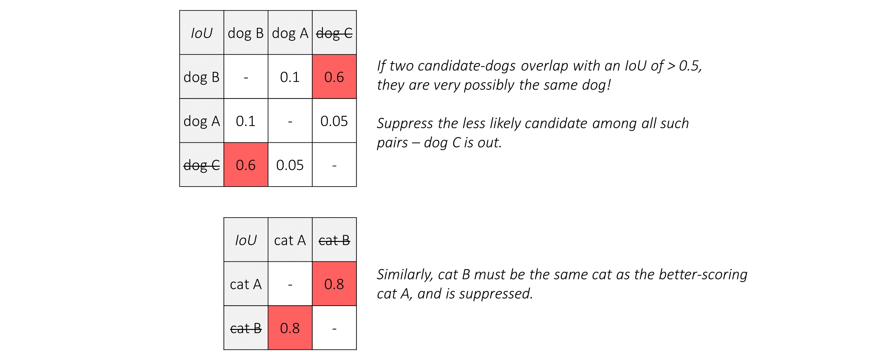

*（译者注：图片大意：*

*上：如果两个“狗”的候选结果之间交并比>0.5，它们极有可能是同一只狗！抑制所有行列中置信度更小的候选结果——dog C 就被淘汰了。*

*下：同样的，cat B 肯定与分数更高的 cat A 是同一只猫，并且它被抑制了。）*

这样，我们就消除了候选结果中的离群点——每种动物都有一只。

这种处理叫做**非最大抑制（NMS）**，当发现多个候选结果明显相互重叠时，他们有可能指的是同一个目标，**我们抑制了分数最高结果以外的所有候选结果**。

从算法上来讲，做如下处理——

- 当选择每一个*非background*类别的候选结果时，
  - 按照置信度递减排列这个类别的候选结果。
  - 注意分数最高的候选结果。丢掉与该结果交并比高于某个值，比如说`0.5`，且得分较低的候选结果。
  - 注意分数第二高的候选结果还在。丢掉与该结果交并比高于某个值，比如说`0.5`，且得分较低的候选结果。
  - 重复直到遍历完整个候选结果队列。

最终结果就是你只会得到一个边框——最好的那个——对于图片上的每个类别而言。

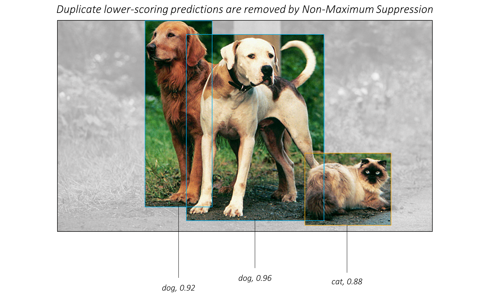

非最大抑制对获得高质量检测结果来说非常重要。

高兴的是，这同样是最后一步。

# 实现

这一部分简要地描述了实现方法。

仅供参考，**细节最好从代码中直接理解**，代码注释很详细。

### 数据集

我们使用VOC2007和2012的数据集

#### 说明

这个数据集包含了20种不同的目标。

```python
{'aeroplane', 'bicycle', 'bird', 'boat', 'bottle', 'bus', 'car', 'cat', 'chair', 'cow', 'diningtable', 'dog', 'horse', 'motorbike', 'person', 'pottedplant', 'sheep', 'sofa', 'train', 'tvmonitor'}
```

每张图片包含了一个及以上的目标类别。

每个目标的表示——

- 绝对边界坐标表示的定位框
- 标签（上述目标类别的一个）
- 一个感知检测难度（要么`0`，要么`1`，`0`表示不*困难*，`1`表示*困难*）

#### 下载

显然，你需要下载这些数据集

- [2007 _训练集_](http://host.robots.ox.ac.uk/pascal/VOC/voc2007/VOCtrainval_06-Nov-2007.tar) (460MB)

- [2012 _训练集_](http://host.robots.ox.ac.uk/pascal/VOC/voc2012/VOCtrainval_11-May-2012.tar) (2GB)

- [2007 _测试集_](http://host.robots.ox.ac.uk/pascal/VOC/voc2007/VOCtest_06-Nov-2007.tar) (451MB)

与论文中一致，这两个*训练集*用于训练数据，VOC 2007 *测试集*将作为我们的测试数据

确保你把VOC 2007 *训练集*和2007 *测试集*提取到同一位置，也就是说，把他们合并起来。

### 喂数据

我们将需要三种数据。

#### 图片

因为我们用的是SSD300这个变体，图片需要被转换到RGB模式下`300, 300`的尺寸。

还记得吗，我们用的是基于ImageNet预训练的VGG-16基础模型，它已经内置在了PyTorch的`torchvision`模块。[这个界面](https://pytorch.org/docs/master/torchvision/models.html)详细说明了使用这个模型我们需要做的转换和预处理——像素值必须在[0,1]并且我们不许使用ImageNet图片RGB通道的平均值和标准差来标准化这些值。*（译者注：此处的标准化与正态分布的标准化操作相同）*

```python
mean = [0.485, 0.456, 0.406]
std = [0.229, 0.224, 0.225]
# 译者注：mean表示平均值，std表示标准差
```

PyTorch也遵循NCHW准则，这意味着维度（C）必须在尺寸维度之前

因此，喂给模型的图片必须是一个`N, 3, 300, 300 `维度的`Float`张量，并且必须通过上述的平均值和标准差来标准化。`N`就是批次大小。

#### 目标的定位框

对于每一张图片，我们需要提供其中呈现的实实在在的目标的定位框的坐标，这些坐标以分数形式给出`(x_min, y_min, x_max, y_max)`。

由于在任意给出的图片中，目标的数量会改变，我们不能使用一个固定大小的张量来存储整个批次`N`张图的定位框。

因此，**喂给模型的实实在在的定位框应当是一个长度为`N`的列表，这个列表中的每个元素都是一个`N_o, 4`维度的`Float`张量**，其中`N_o`是某张图上所呈现的目标总数。

#### 目标标签

对于每张图片，我们需要提供其中呈现的实实在在的标签。

每个标签都需要编码为一个整数，从`1`到`20`，代表着20中不同的目标类别。此外，我们将添加一个*background*类别，其索引为`0`，这表示定位框中没有目标。（一般情况下，这个标签不会用来表示数据集中任何实实在在的目标。）

同样的，由于在任意给出的图片中，目标的数量会改变，我们不能使用一个固定大小的张量来存储整个批次`N`张图的标签。

因此，**喂给模型的实实在在的定位框应当是一个长度为`N`的列表，这个列表中的每个元素都是一个`N_o`维度的`Long`张量**，其中`N_o`是某张图上所呈现的目标总数。

### 数据加工

你知道的，我们的数据被分为了*训练集*和*测试集*

#### 分析原始数据

你能在 [`utils.py`](https://github.com/sgrvinod/a-PyTorch-Tutorial-to-Object-Detection/blob/master/utils.py) 中的 `create_data_lists()` 看到。

分析下载下来的数据并保存下面这些文件——

- 一个**JSON文件，对于每个子集，其包含了`I`张图绝对路径的列表**，其中`I`指该子集中图片的总数。
- 一个**JSON文件，对于每个子集，其包含了`I`个字典的列表，字典中包含实实在在的目标，也就是定位框的绝对边界坐标形式，其编码后的标签，和感知检测难度**。列表中的第`i`个字典将包含上一个JSON文件中第`i`张图上所呈现的目标。
- 一个**JSON文件，其中包含了`label_map`**，标签到索引的字典，在上一个JSON文件中用该字典来对标签编码。这个字典可以通过 [`utils.py`](https://github.com/sgrvinod/a-PyTorch-Tutorial-to-Object-Detection/blob/master/utils.py) 得到，并可以直接导入。

#### PyTorch数据集

你能在 [`datasets.py`](https://github.com/sgrvinod/a-PyTorch-Tutorial-to-Object-Detection/blob/master/datasets.py) 中的`PascalVOCDataset` 看到

这是一个Pytorch [`Dataset`](https://pytorch.org/docs/master/data.html#torch.utils.data.Dataset) 的子类，用来**定义我们的训练集和测试集**。他需要定义一个`__len__`方法，其返回数据集的大小，还要定义一个`__getitem__`方法来返回第`i`张图片、这张图中的定位框，和这张图中目标的标签，这个标签可以通过使用我们之前保存的JSON文件。

你会注意到它同样返回了每个目标的感知检测难度，但其并不会真正的用于训练模型。仅在[评估](https://github.com/sgrvinod/a-PyTorch-Tutorial-to-Object-Detection#evaluation)阶段我们才会用它来计算平均精度(mAP)。我们可以选择完全过滤掉数据集中*困难*的目标，通过牺牲精度来加速训练。

此外，在这些类别中，**每张图片和其中的目标都经过了一系列变换**，这个变换在论文中有讲，大致如下。

#### 数据变换

你可以在 [`utils.py`](https://github.com/sgrvinod/a-PyTorch-Tutorial-to-Object-Detection/blob/master/utils.py)  中的 `transform()` 看到

这个函数对图片和其中的目标做如下变换——

- 随机**调整亮度，对比度，饱和度和色调**，每次都有50%的概率并且是按照随机顺序变换。
- 50%的概率对图片**施加一个缩小操作**。这有助于学习检测小目标。缩小后的图片必须在原始图像的`1`到`4`倍之间。周围的空间可以用ImageNet数据的平均值填充。
- 随机裁剪图片，也就是**施加一个放大操作**。这有助于学习检测大目标或者只有一部分的目标。甚至有些目标会被完全剪掉。裁剪尺寸应当在原图的`0.3`到`1`倍之间。裁剪部分的横纵比应当在`0.5`到`2`之间。每次裁剪应当满足这样的条件：至少剩下一个定位框，并且定位框与被裁剪掉的部分的交并比应当是`0, 0.1, 0.3, 0.5, 0.7, 0.9`中的随机一个。此外，通过裁剪，任意一个剩下的定位框的中心应当不在图片中。当然，同样也有概率不裁剪图片。
- 50%的概率水平翻转图片。
- 将图片**重塑（resize）**到`300, 300`像素。SSD300要求这样。
- 将所有定位框**从绝对坐标转换为分数边界坐标**。在我们模型的所有阶段，所有的边界坐标和中心-大小坐标都将是他们的分数形式。
- 用ImageNet数据的平均值和标准差**标准化**图片，ImageNet是用于预训练VGG base的数据。

正如论文中所提到的，这些变换在取得既定结果上有这至关重要的作用。

#### Pytorch DataLoader

之前说的`Dataset`就是`PascalVOCDataset`，将在 `train.py` 通过 PyTorch [`DataLoader`](https://pytorch.org/docs/master/data.html#torch.utils.data.DataLoader) 来**创建多批数据来喂给模型**，这几批数据用于训练或是评估。

因为不同图片上的目标数量不同，他们的定位框，标签，和难度不能单纯地叠加进批次中。这会把哪些目标属于哪些图片混为一谈。

相反，我们需要在构建`DataLoader`时**在`collate_fn`参数中传入一个整理函数**，这个函数是关于如何把这些大小不定的张量结合起来的。最好的选择或许是Python的列表。

### 基础卷积

 你能在 [`model.py`](https://github.com/sgrvinod/a-PyTorch-Tutorial-to-Object-Detection/blob/master/model.py) 中的 `VGGBase` 看到。

这里，我们**创建并应用基础卷积**

这几层是通过VGG-16的参数初始化的，这个初始化在`load_pretrained_layers()` 方法中。

我们要特别注意低维特征图，这些特征图是来自`conv4_3`和`conv7`的结果，我们把它返回出来供之后的阶段使用。

### 辅助卷积

你能在 [`model.py`](https://github.com/sgrvinod/a-PyTorch-Tutorial-to-Object-Detection/blob/master/model.py) 中的 `AuxiliaryConvolutions` 看到。

这里，我们**创建并应用辅助卷积**

使用[Xavier初始化（uniform Xavier initialization）](https://pytorch.org/docs/stable/nn.html#torch.nn.init.xavier_uniform_)来初始化这几层的参数。

我们要特别注意高维特征图，这些特征图是来自`conv8_2`, `conv9_2`, `conv10_2` 和`conv11_2`的结果，我们把它返回出来供之后的阶段使用。

### 预测卷积

你能在 [`model.py`](https://github.com/sgrvinod/a-PyTorch-Tutorial-to-Object-Detection/blob/master/model.py) 中的 `PredictionConvolutions` 看到。

这里，我们**创建并应用定位卷积核类别预测卷积**，输入是来自 `conv4_3`, `conv7`, `conv8_2`, `conv9_2`, `conv10_2` 和`conv11_2`的特征图。

这几层与辅助卷积的初始化方式相同。

我们还会**重塑预测结果图并拼接他们**，就像我们说过的那样。注意，当且仅当原来的张量存储内存中[相邻](https://pytorch.org/docs/stable/tensors.html#torch.Tensor.contiguous)的块时，重塑（reshaping）在PyTorch中才能使用。

不出意外的话，拼接后的位置预测和类别预测的维度分别是`8732, 4`和`8732, 21`。

### 组装模型

你能在 [`model.py`](https://github.com/sgrvinod/a-PyTorch-Tutorial-to-Object-Detection/blob/master/model.py) 中的 `SSD300` 看到。

这里，基础、辅助和预测卷积都会结合起来，形成SSD。

有个小细节——最低维的特征也就是来自`conv4_3`的特征，比起它的高维特征，它会在一个显著不同的缩放尺寸上。因此，作者推荐使用L2正则化并以一个可学习的值重新缩放它的*每个*通道。

### 预定位框

你能在 [`model.py`](https://github.com/sgrvinod/a-PyTorch-Tutorial-to-Object-Detection/blob/master/model.py) 中的 `SSD300` 下的`create_prior_boxes()`看到。

这个函数**以中心-大小坐标创建预定位框**，特征图上的预定位框创建顺序为`conv4_3`, `conv7`, `conv8_2`, `conv9_2`, `conv10_2` and `conv11_2`。并且，对于每一个特征图，我们按行遍历其中的每一块。

按这种顺序得到了8732个预定位框非常重要，因为他需要与叠加后的预测结果顺序相同。

### 多定位框损失

你能在 [`model.py`](https://github.com/sgrvinod/a-PyTorch-Tutorial-to-Object-Detection/blob/master/model.py) 中的 `MultiBoxLoss` 看到。

对于每张图片上的8732个预测定位框，创建了两个空张量来存储定位和类别预测的目标，也就是*真值*。

我们**通过每个预定位框交并比的最大值找到目标真值**，把它们存入`object_for_each_prior`。

我们希望避免一种罕见的情况，并非所有的真值都被匹配到。因此，我们还需要找到与每个真值有最大交并比的预定位框，把它存入`prior_for_each_object`。我们明确的把这些匹配项添加到`object_for_each_prior`中，并手动设置它们的重叠度高于阈值，这样它们就不会被扔掉。

对于8732个预定位框的每一个，基于 `object_for_each prior`中的匹配项，我们为其设置相应的标签，也就是**类别预测的目标**。对于哪些不明显重合于它们所匹配的目标的预定位框，将标签设置为*background*。

此外，我们还要把8732个预定位框在 `object_for_each prior`中的坐标编码为偏移量的形式 `(g_c_x, g_c_y, g_w, g_h)` 来构成**定位的目标**。并非所有的8732个定位目标都是有意义。就像我们之前讨论的那样。仅仅只有那些来自非背景的预定位框会用来拟合他们的目标。

定位损失是在正匹配项上的[平滑L1损失](https://pytorch.org/docs/stable/nn.html#torch.nn.SmoothL1Loss)。

接下来做硬性负样本挖掘——按照单独的[交叉熵损失](https://pytorch.org/docs/stable/nn.html#torch.nn.CrossEntropyLoss)，给类别预测与*background*的匹配项，也就是负匹配项排序。**置信度损失**就是正匹配项与硬性负匹配项的交叉熵损失。但是这个损失仅仅只被负匹配项的数量所平均。

**多定位框损失就是两种损失的综合**，按照一个比例`α`结合，在我们这里，简单的取`α = 1`让他们相加。

# 训练

开始之前，确保你保存了训练和测试需要的文件。可以运行[`create_data_lists.py`](https://github.com/sgrvinod/a-PyTorch-Tutorial-to-Object-Detection/blob/master/create_data_lists.py)，并指定其中的 `VOC2007` 和 `VOC2012` 的数据集文件夹，[下载数据](https://github.com/sgrvinod/a-PyTorch-Tutorial-to-Object-Detection#download)已经说明了这些数据集。

接下来看**[`train.py`](https://github.com/sgrvinod/a-PyTorch-Tutorial-to-Object-Detection/blob/master/train.py)**

这个模型的参数（和训练）在文件的开头，因此你能非常轻松地根据你的需要检查和修改。

运行这个文件以**从头开始训练模型**——

`python train.py`

在 `checkpoint` 参数中指定相应的文件以**将模型恢复到一个检查点（checkpoint）**

### 注意

在论文中。他们建议在32张图一个批次的情况下，使用**随机梯度下降法（Stochastic Gradient Descent STG）**，初始学习率`1e−3`，动量（momentum）`0.9`，和`5e-4`的权重衰减。

为了提高稳定性，我最终使用`8`张图一个批次。如果你发现了梯度爆炸，你可以尝试减少批次大小，就像我做的那样，也可以梯度截断。

作者还将偏执项的学习率提高了一倍。你在代码中也能看见，这在Pytorch中很简单，通过将[单独的参数组](https://pytorch.org/docs/stable/optim.html#per-parameter-options)传入[SGD 优化器(optimizer)](https://pytorch.org/docs/stable/optim.html#torch.optim.SGD)的`params`参数。

论文推荐以出示学习率训练迭代80000次，然后减小90%（也就是一成）再额外训练迭代20000次，*重复两次*。在论文`32`批次大小的情况下，这意味着学习率在第154次epoch减小90%，并在第193次epoch再次减小90%，最后训练停止在了第232次epoch。我和这个安排一样。

在TitanX(Pascal)上，每个epoch训练需要大约6min。*（译者注：TitanX(Pascal)是一款GPU）*

我需要指出一点，本教程的读者让我注意到意想不到的与论文中的两个差异：

- 我的定位框超过图片的部分没有被剪掉，由 *@AakiraOtok* 在[#94](https://github.com/sgrvinod/a-PyTorch-Tutorial-to-Object-Detection/issues/94)中指出。然而，通过在这个问题下的讨论和该读者[#95](https://github.com/sgrvinod/a-PyTorch-Tutorial-to-Object-Detection/issues/95)的issue中的证明，这似乎对模型效果没有负面影响，甚至有可能对模型效果有轻微的提升，但是效果甚微。
- 在定位误差中我错误的使用了L1损失。而不是*平滑*L1损失，由_jonathan016_在[#60](https://github.com/sgrvinod/a-PyTorch-Tutorial-to-Object-Detection/issues/60) 中提出。 正如issue中所指出的那样，这同样对模型效果没有负面影响，但在更大的批次大小中，*平滑*L1损失或许能提供更好的训练稳定性，正如[这个评论](https://github.com/sgrvinod/a-PyTorch-Tutorial-to-Object-Detection/issues/94#issuecomment-1590217018)所说。

### 模型检查点

你可以在这里[下载](https://drive.google.com/open?id=1bvJfF6r_zYl2xZEpYXxgb7jLQHFZ01Qe)预训练模型

注意这个检查点应当[直接由Pytorch加载](https://pytorch.org/docs/stable/torch.html?#torch.load)用于评估或是推理——如下所示

# 评估

对应 [`eval.py`](https://github.com/sgrvinod/a-PyTorch-Tutorial-to-Object-Detection/blob/master/eval.py)。

用于评估的数据加载和检查点参数在这个文件的开头，因此你能非常轻松地根据你的需要检查和修改。

要开始评估，用数据加载器（data-loader）和模型检查点运行一下`evaluate()`这个函数就行了。**测试集每张图的原始预测结果**都可以通过检查点的`detect_objects()`方法**获得并解析**，其已经在[这个程序](https://github.com/sgrvinod/a-PyTorch-Tutorial-to-Object-Detection#processing-predictions)中实现了。评估会以`min_score`为`0.01`，非最大抑制的`max_overlap`为`0.45`并且`top_k`为`200`来保证结果的公平比较，就像论文和其他实现那样。

**根据准确值评估解析后的预测值。**其评估方法为*平均精确率(mAP)*。如果你不熟悉这个方法，[这篇文章](https://medium.com/@jonathan_hui/map-mean-average-precision-for-object-detection-45c121a31173)能让你茅塞顿开。

我们使用[`utils.py`](https://github.com/sgrvinod/a-PyTorch-Tutorial-to-Object-Detection/blob/master/utils.py)中的`calculate_mAP()`来完成这一点。按照惯例，在mAP的计算中，我们将忽略*困难*的检测。但把他们包含在评估数据集中很重要，因为如果模型检测出一个它认为*困难*的目标，这个预测结果就必须当做假正例（false positive）处理。

模型的得分是**77.2mAP**，与论文中说的相同。

按照类别划分的平均准确率（没有按照比例缩放到100）在下面列出。

|     类别      |     平均准确率      |
| :-----------: | :-----------------: |
|  _aeroplane_  | 0.7887580990791321  |
|   _bicycle_   | 0.8351995348930359  |
|    _bird_     | 0.7623348236083984  |
|    _boat_     | 0.7218425273895264  |
|   _bottle_    | 0.45978495478630066 |
|     _bus_     | 0.8705356121063232  |
|     _car_     | 0.8655831217765808  |
|     _cat_     | 0.8828985095024109  |
|    _chair_    | 0.5917483568191528  |
|     _cow_     | 0.8255912661552429  |
| _diningtable_ |  0.756867527961731  |
|     _dog_     |  0.856262743473053  |
|    _horse_    | 0.8778411149978638  |
|  _motorbike_  | 0.8316892385482788  |
|   _person_    | 0.7884440422058105  |
| _pottedplant_ | 0.5071538090705872  |
|    _sheep_    | 0.7936667799949646  |
|    _sofa_     | 0.7998116612434387  |
|    _train_    | 0.8655905723571777  |
|  _tvmonitor_  | 0.7492395043373108  |

你可以发现，像bottles和potted plants这样的东西比其他类别检测起来难得多。

# 推理

见 [`detect.py`](https://github.com/sgrvinod/a-PyTorch-Tutorial-to-Object-Detection/blob/master/detect.py)。

在代码的顶部指定你想要用来推理模型的的`checkpiont`参数。

接下来，可以使用`detect()`函数来识别图片并将其可视化。

```python
img_path = '/path/to/ima.ge'
original_image = PIL.Image.open(img_path, mode='r')
original_image = original_image.convert('RGB')

detect(original_image, min_score=0.2, max_overlap=0.5, top_k=200).show()
```

由于模型需要，这个函数先通过**重塑并标准化图片的RGB通道来**处理它。然后获取到了模型的**原始预测结果**，通过`detect_objects()`方法解析。解析后的结果将被从分数形式转换为绝对边界坐标，预测结果的标签都是由`label_map`所编码的，最后在**图片上可视化**。

`min_score`, `max_overlap`和`top_k`都没有一个通用的值，你需要一点点实验去找到最适合你的目标的数据。

### 更多例子

---

<p align="center">
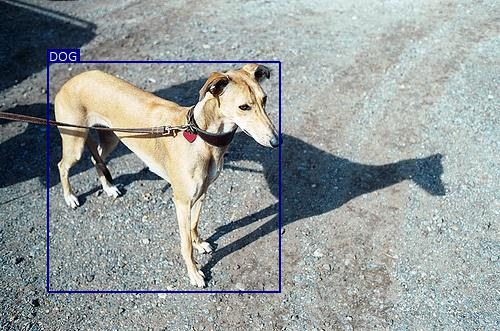
</p>

---

<p align="center">
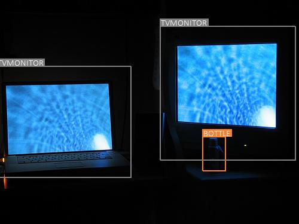
</p>

---

<p align="center">
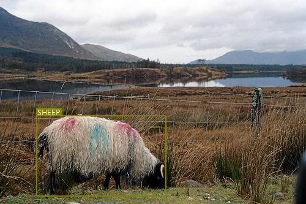
</p>

---

<p align="center">
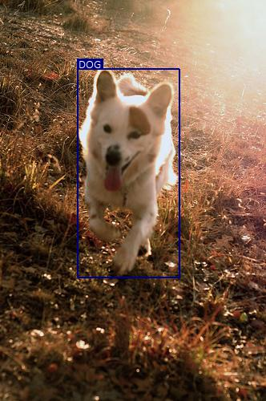
</p>

---

<p align="center">
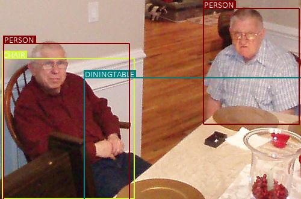
</p>

---

<p align="center">
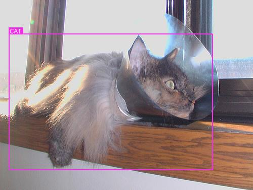
</p>

---

<p align="center">
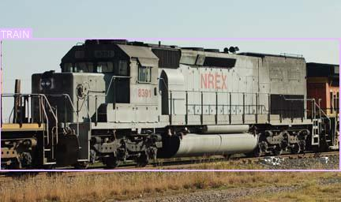
</p>

---

<p align="center">
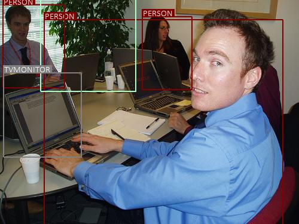
</p>

---

<p align="center">
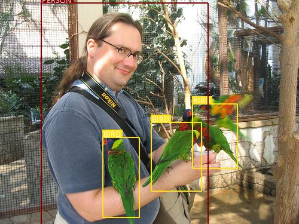
</p>

---

<p align="center">
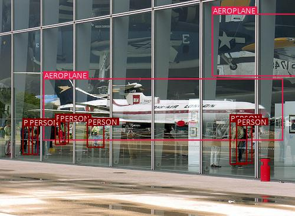
</p>

---

<p align="center">
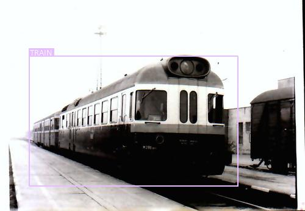
</p>

---

# FAQs

**我注意到预定位框通常超过了在预测卷积中`3, 3`的卷积核。卷积核是如何检测到（目标的）边界的？**

不要对卷积核和他的*感受域*有疑惑，其感受域是原始图像中的一些区域，这些区域代表着卷积核的视野。

例如，在来自`conv4_3`的`38, 38`的特征图上，一个`3, 3`的卷积核覆盖了`0.08, 0.08`的分数坐标区域。那么其中的预定位框就是 `0.1, 0.1`, `0.14, 0.07`, `0.07, 0.14`和 `0.14, 0.14`。

但它的感受域，[是可以计算的](https://medium.com/mlreview/a-guide-to-receptive-field-arithmetic-for-convolutional-neural-networks-e0f514068807)，是惊人的`0.36, 0.36`！因此，所有预定位框（目标包含在其中）在其内部展示得很好。

注意，视野域是通过每一次连续的卷积成长的。对于`conv_7`以及更高维的特征图，一个`3, 3`的卷积核的视野域将覆盖*整个*`300, 300`的图片。但，通常情况下，原图中靠近卷积核中心的像素会有更高的权重，所以从某种意义上说它任然是局部。

---

**训练的时候，为什么不能直接预测定位框与目标直接配对呢？**

我们不能直接通过预测定位框和目标的重叠或者重合来直接匹配它们，因为预测定位框被认为是不可靠的，*特别*是训练过程中。这正是我们试图首先评估它们的原因！

这也是预定位框非常有用的原因。我们能将一个预测定位框与一个目标定位框配对，因为预测定位框应与其相似。预测的正确与否已经不重要了。

---

**为什么检查只达到了*non-background*类阈值的结果中任然有*background*类？**

当没有目标在预定位框的近似域内，分数高的*background*将稀释其他类别的得分，因为他们没有达到检测阈值。

---

**为什么不简单地选择最高得分的类别而不是使用一个阈值**？

我认为这是一个有效的策略，毕竟我们在训练模型时，通过交叉熵损失要求模型只选择*一个*类别。但你会发现，你不会达到和使用阈值一样的效果。

我怀疑这是因为目标检测是足够开放的，以至于在训练模型中对于预定位框中的内容存在疑问。例如，如果预定位框内有大量背景可见，*background*的分数可能很高。甚至可能有多种目标在同一个近似域呢。一个简单的阈值将得出所有我们考虑的可能，它就是这样效果更好。

冗余的检测并不真的是一个问题，因为我们用NMS送走了他们。

---

**虽然但是...*[盒盒盒盒子里面是啥？！](https://cnet4.cbsistatic.com/img/cLD5YVGT9pFqx61TuMtcSBtDPyY=/570x0/2017/01/14/6d8103f7-a52d-46de-98d0-56d0e9d79804/se7en.png)***

哈


